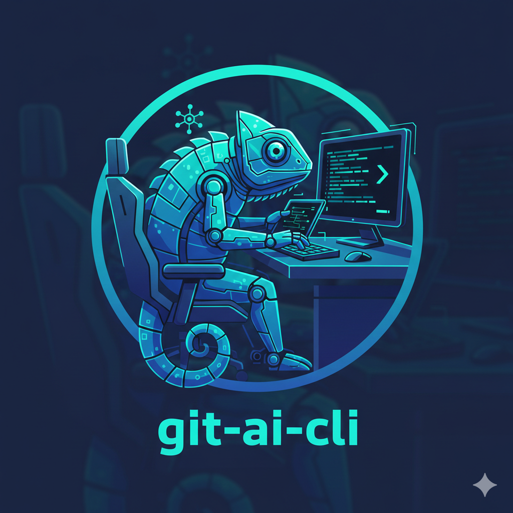
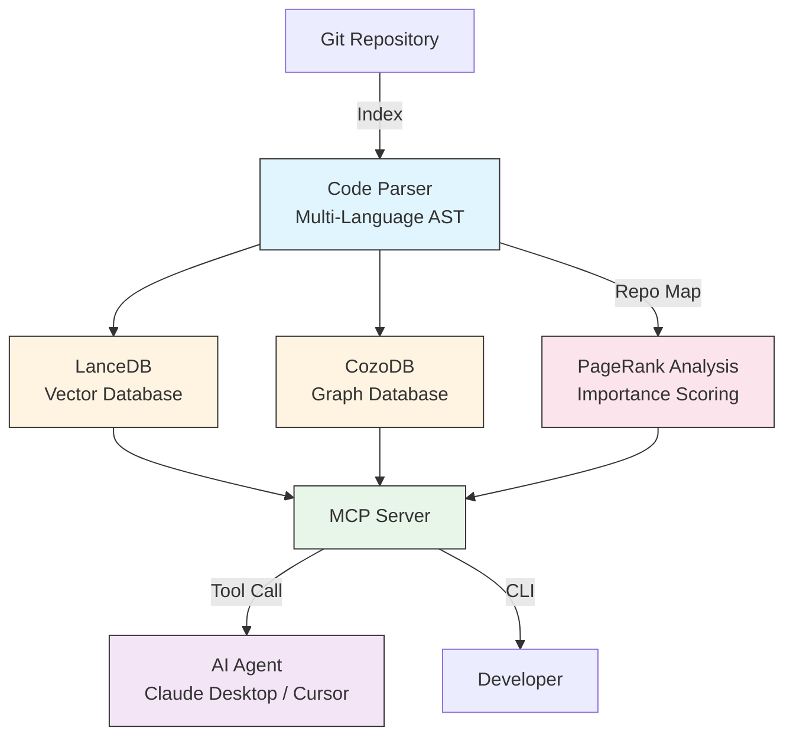

<p align="center">
  
</p>

# git-ai

[](https://github.com/mars167/git-ai-cli/actions/workflows/ci.yml)
[](https://github.com/mars167/git-ai-cli/actions/workflows/release.yml)
[](./LICENSE)
[](https://www.npmjs.com/package/@mars167/git-ai)
[](https://www.npmjs.com/package/@mars167/git-ai)
[](https://skills.sh)

[🇨🇳 简体中文](./README.zh-CN.md) | **English**

---

<div align="center">

### 🚀 Quick Install

**For AI Agents (Claude Code, Cursor, Windsurf, etc.)**

```bash
npx skills add mars167/git-ai-cli/skills/git-ai-code-search
```

**For CLI Usage**

```bash
npm install -g @mars167/git-ai
```

</div>

---

## Adding a Semantic Layer to Your Codebase, Enabling AI to Evolve from "Reading Code" to "Understanding Code"

**Code semantics should be versioned and traceable, just like code itself**

git-ai is a local code understanding tool that builds a semantic layer for your codebase using advanced RAG techniques, enabling AI Agents and developers to deeply understand code structure and relationships.

### ✨ Why git-ai?

- **🔗 Advanced RAG**: Combines vector retrieval + graph retrieval for multi-dimensional semantic understanding
- **📊 Fast & Accurate**: Optimized repo-map with PageRank-based importance scoring
- **🔄 Always Available**: Indices travel with code, available immediately after checkout, no rebuild needed
- **🤖 AI-Native**: MCP Server enables Claude, Trae and other Agents to deeply understand your codebase
- **🔒 Fully Local**: Code never leaves your machine, secure and private
- **⚡ Full Lifecycle Support**: From development to Review to refactoring, indices span the entire lifecycle
- **📊 Blazing Fast**: 10k files indexed in < 30s, search response < 100ms

---

## ✨ Core Capabilities

### 1️⃣ Semantic Search

Find code using natural language, no need to remember file names or function names:

```bash
git-ai ai semantic "user authentication logic"
git-ai ai semantic "database connection pool configuration"
git-ai ai semantic "error handling middleware"
```

### 2️⃣ Symbol Relationship Analysis

Understand relationships between code:

```bash
# Find function callers
git-ai ai graph callers authenticateUser

# Find functions called by this function
git-ai ai graph callees authenticateUser

# Trace complete call chain
git-ai ai graph chain authenticateUser --max-depth 3
```

### 3️⃣ Multi-Language Support

Supports multiple mainstream programming languages:

| Language | File Extensions |
|----------|-----------------|
| JavaScript | `.js`, `.jsx` |
| TypeScript | `.ts`, `.tsx` |
| Java | `.java` |
| Python | `.py` |
| Go | `.go` |
| Rust | `.rs` |
| C | `.c`, `.h` |
| Markdown | `.md`, `.mdx` |
| YAML | `.yml`, `.yaml` |

---

## 💡 Design Philosophy

git-ai is built for deep code understanding through multiple retrieval strategies:

### Advanced RAG

Combines multiple retrieval methods for deeper understanding:
- **Vector Retrieval**: Semantic similarity matching using SQ8 quantized embeddings
- **Graph Retrieval**: Call relationship and dependency analysis via AST graphs
- **Intelligent Fusion**: Weighted combination of retrieval strategies for optimal results

### Decentralized Semantics

Indices travel with code, no central server required. checkout, branch, tag—all can use consistent semantic indices immediately.

### Server Mode

MCP Server enables any AI Agent to invoke indices, achieving true AI-assisted development.

---

## 🎯 Use Cases

### Scenario 1: Newcomers Quickly Understanding Large Projects

> "Just joined the team, facing 100k lines of code, where do I start?"

```bash
# 1. Get project global view
git-ai ai repo-map --max-files 20

# 2. Search core business logic
git-ai ai semantic "order processing flow"

# 3. Trace key function call chains
git-ai ai graph chain processOrder --max-depth 5
```
*From design to development, semantic indices remain consistent*

### Scenario 2: Pre-Refactoring Impact Analysis

> "About to refactor this function, what will it affect?"

```bash
# Find all callers
git-ai ai graph callers deprecatedFunction

# Analyze complete call chain
git-ai ai graph chain deprecatedFunction --direction upstream
```
*Graph analysis reveals complete impact scope*

### Scenario 3: Bug Localization and Root Cause Analysis

> "User reported an error, but don't know where the problem is"

```bash
# Search related error handling code
git-ai ai semantic "user login failure handling"

# View error propagation path
git-ai ai graph chain handleLoginError --direction upstream
```
*Full lifecycle indices, quickly locate problem roots*

### Scenario 4: AI Agent-Assisted Development

> "Let Claude Desktop help me understand this project"

After configuring git-ai MCP Server in Claude Desktop, you can converse directly:

> "Help me analyze this project's architecture, find all payment-related code, and explain their relationships"

Claude will automatically invoke git-ai tools to provide deep analysis. *Enabling AI to evolve from "reading code" to "understanding code"*

---

## 🏗️ System Architecture



**Core Components**:

- **Code Parser**: Multi-language AST extraction (TypeScript, Java, Python, Go, Rust, C, Markdown, YAML)
- **LanceDB + SQ8**: High-performance vector database with quantized embeddings for semantic search
- **CozoDB**: Graph database for AST-level relationship queries (callers, callees, chains)
- **Repo Map**: PageRank-based code importance analysis for project overview
- **MCP Server**: Standard protocol interface for AI Agent invocation

---

## 📊 Comparison with Other Tools

| Feature | git-ai | GitHub Code Search | Sourcegraph |
|---------|--------|-------------------|-------------|
| Local Execution | ✅ | ❌ | ❌ |
| AST-Level Analysis | ✅ | ❌ | ✅ |
| AI Agent Integration | ✅ | ❌ | ❌ |
| Free & Open Source | ✅ | ❌ | ❌ |
| Semantic Search | ✅ | ✅ | ✅ |
| Call Chain Analysis | ✅ | ❌ | ✅ |
| Multi-Language Support | ✅ | ✅ | ✅ |
| Repo Map with PageRank | ✅ | ❌ | ❌ |

---

## 🚀 Quick Start

### 1. Install

```bash
npm install -g @mars167/git-ai
```

### 2. Initialize Repository

```bash
cd your-project
git-ai ai index --overwrite
```

### 3. Start Using Immediately

```bash
# Search code using natural language
git-ai ai semantic "user authentication logic"

# View function call relationships
git-ai ai graph callers authenticateUser
```

**Actual Output Example**:
```json
[
  {
    "file": "src/auth/service.ts",
    "line": 45,
    "symbol": "authenticateUser",
    "context": "async function authenticateUser(email: string, password: string)"
  },
  {
    "file": "src/controllers/auth.ts", 
    "line": 23,
    "symbol": "loginHandler",
    "context": "const user = await authenticateUser(req.body.email, req.body.password)"
  }
]
```

That's it! 3 steps to get started, immediately begin deep understanding of your codebase.

*From now on, indices are not "one-time artifacts" but "semantic assets" that evolve with your code.*

---

## ⚙️ Configuration

### File Filtering

git-ai respects your project's ignore files to control which files are indexed:

#### `.gitignore` - Standard Git Ignore

Files matching patterns in `.gitignore` are excluded from indexing by default.

#### `.aiignore` - AI-Specific Exclusions (Highest Priority)

Create a `.aiignore` file in your repository root to exclude specific files from indexing that should be ignored by git-ai but not necessarily by Git:

```bash
# Example .aiignore
test-fixtures/**
*.generated.ts
docs/api-reference/**
```

#### `.git-ai/include.txt` - Force Include (Overrides `.gitignore`)

Sometimes you need to index generated code or files that are in `.gitignore` but important for code understanding. Create `.git-ai/include.txt` to force-index specific patterns:

```bash
# Example .git-ai/include.txt
# Include generated API clients
generated/api/**

# Include specific build artifacts that contain important types
dist/types/**

# Include code from specific ignored directories
vendor/important-lib/**
```

**Priority Order (Highest to Lowest):**
1. `.aiignore` - Explicit exclusions always win
2. `.git-ai/include.txt` - Force-include patterns override `.gitignore`
3. `.gitignore` - Standard Git ignore patterns

**Supported Pattern Syntax:**
- `**` - Match any number of directories
- `*` - Match any characters within a directory
- `directory/` - Match entire directory (automatically converts to `directory/**`)
- `file.ts` - Match specific file
- Lines starting with `#` are comments

**Example Configuration:**

```bash
# .gitignore
dist/
generated/
*.log

# .git-ai/include.txt
generated/api/**
generated/types/**

# .aiignore (overrides everything)
generated/test-data/**
```

With this configuration:
- ✅ `generated/api/client.ts` - Indexed (included via include.txt)
- ✅ `generated/types/models.ts` - Indexed (included via include.txt)
- ❌ `generated/test-data/mock.ts` - Not indexed (.aiignore takes priority)
- ❌ `dist/bundle.js` - Not indexed (.gitignore, not in include.txt)

---

## 🛠️ Troubleshooting

### Windows Installation Issues

git-ai uses [CozoDB](https://github.com/cozodb/cozo) for AST graph queries. On Windows, if you encounter installation errors related to `cozo-node`, try these solutions:

**Option 1: Use Gitee Mirror (Recommended for users in China)**

```bash
npm install -g @mars167/git-ai --cozo_node_prebuilt_binary_host_mirror=https://gitee.com/cozodb/cozo-lib-nodejs/releases/download/
```

**Option 2: Configure npm proxy**

If you're behind a corporate firewall or proxy:

```bash
npm config set proxy http://your-proxy:port
npm config set https-proxy http://your-proxy:port
npm install -g @mars167/git-ai
```

**Option 3: Manual binary download**

1. Download the Windows binary from [cozo-lib-nodejs releases](https://github.com/cozodb/cozo-lib-nodejs/releases)
2. Look for `6-win32-x64.tar.gz` (for 64-bit Windows)
3. Extract to `node_modules/cozo-node/native/6/`

**Verify installation:**

```bash
git-ai ai status --path .
```

If you see graph-related features working, installation was successful.

### Other Native Dependencies

git-ai also uses these native packages that may require similar troubleshooting:
- `onnxruntime-node` - For semantic embeddings
- `tree-sitter` - For code parsing
- `@lancedb/lancedb` - For vector database

Most issues are resolved by ensuring a stable network connection or using a mirror.

---

## 🤖 AI Agent Integration

git-ai provides a standard MCP Server that seamlessly integrates with:

- **Claude Desktop**: The most popular local AI programming assistant
- **Cursor**: AI-powered code editor
- **Trae**: Powerful AI-driven IDE
- **Continue.dev**: VS Code AI plugin

### Single Agent (stdio mode - default)

Add to `~/.claude/claude_desktop_config.json`:

```json
{
  "mcpServers": {
    "git-ai": {
      "command": "git-ai",
      "args": ["ai", "serve"]
    }
  }
}
```

### Multiple Agents (HTTP mode)

When you need multiple AI agents to connect simultaneously (e.g., Claude Code + Cursor):

```bash
# Start HTTP server (supports multiple clients)
git-ai ai serve --http --port 3000
```

Then configure each agent to connect to `http://localhost:3000/mcp`.

**HTTP mode features:**
- Multiple concurrent sessions
- Health check endpoint: `http://localhost:3000/health`
- Session management with automatic cleanup
- Session persistence via `mcp-session-id` response header
- Comprehensive error handling with proper HTTP status codes
- Graceful shutdown with SIGTERM/SIGINT signal handlers
- Optional stateless mode for load-balanced setups: `--stateless`

Then restart Claude Desktop and start conversing:

> "Help me analyze this project's architecture, find all payment-related code"

Claude will automatically invoke git-ai tools to provide deep analysis.

### Agent Skills & Rules

We provide carefully designed Agent templates to help AI use git-ai better:

- [Skill Template](./templates/agents/common/skills/git-ai-code-search/SKILL.md): Guides Agents on how to use tools
- [Rule Template](./templates/agents/common/rules/git-ai-code-search/RULE.md): Constrains Agent behavior

Skills/Rules docs (Markdown/YAML) are indexed as part of semantic search, so agents can retrieve MCP guidance via `semantic_search`.

One-click install to your project:

```bash
git-ai ai agent install
```

---

## 📚 Documentation

- [Quick Start](./docs/README.md)
- [MCP Server Guide](./docs/mcp.md)
- [Architecture Explained](./docs/architecture_explained.md)
- [Design Document](./docs/design.md)
- [Development Guide](./DEVELOPMENT.md)

---

## 🔧 Advanced Features

### Git Hooks Automation

Automatically rebuild indices before commit, verify pack before push:

```bash
git-ai ai hooks install
```

- `pre-commit`: Auto incremental index + pack
- `pre-push`: Verify pack
- `post-checkout`: Auto unpack

### Git LFS Integration

Recommended for managing index archives:

```bash
git lfs track ".git-ai/lancedb.tar.gz"
git-ai ai pack --lfs
```

---

## 🤝 Contributing

Welcome contributions, issue reports, and suggestions!

- [Contribution Guide](./CONTRIBUTING.md)
- [Issue Tracker](https://github.com/mars167/git-ai-cli/issues)

---

## 📄 License

[MIT](./LICENSE)

---

**Enabling AI to Evolve from "Reading Code" to "Understanding Code"** ⭐ Star us on GitHub!
