<p align="center">
  
</p>

# git-ai

[](https://github.com/mars167/git-ai-cli/actions/workflows/ci.yml)
[](https://github.com/mars167/git-ai-cli/actions/workflows/release.yml)
[](./LICENSE)
[](https://www.npmjs.com/package/@mars167/git-ai)
[](https://www.npmjs.com/package/@mars167/git-ai)
[](https://skills.sh)

[🇨🇳 简体中文](./README.zh-CN.md) | **English**

---

<div align="center">

### 🚀 Quick Install

**For AI Agents (Claude Code, Cursor, Windsurf, etc.)**

```bash
npx skills add mars167/git-ai-cli/skills/git-ai-code-search
```

**For CLI Usage**

```bash
npm install -g @mars167/git-ai
```

</div>

---

## Adding a Semantic Layer to Your Codebase, Enabling AI to Evolve from "Reading Code" to "Understanding Code"

**Code semantics should be versioned and traceable, just like code itself**

git-ai is a local code understanding tool that builds a traceable semantic layer for your codebase using DSR (Deterministic Semantic Record) and Hyper RAG, enabling AI Agents and developers to truly understand code evolution and relationships.

### ✨ Why git-ai?

- **🔗 Hyper RAG**: Combines vector retrieval + graph retrieval + DSR for multi-dimensional semantic understanding
- **📜 Versioned Semantics**: Every commit has a semantic snapshot, historical changes are clear and traceable
- **🔄 Always Available**: Indices travel with code, available immediately after checkout, no rebuild needed
- **🤖 AI-Native**: MCP Server enables Claude, Trae and other Agents to deeply understand your codebase
- **🔒 Fully Local**: Code never leaves your machine, secure and private
- **⚡ Full Lifecycle Support**: From development to Review to refactoring, indices span the entire lifecycle
- **📊 Blazing Fast**: 10k files indexed in < 30s, search response < 100ms

---

## ✨ Core Capabilities

### 1️⃣ Semantic Search

Find code using natural language, no need to remember file names or function names:

```bash
git-ai ai semantic "user authentication logic"
git-ai ai semantic "database connection pool configuration"
git-ai ai semantic "error handling middleware"
```

### 2️⃣ Symbol Relationship Analysis

Understand relationships between code:

```bash
# Find function callers
git-ai ai graph callers authenticateUser

# Find functions called by this function
git-ai ai graph callees authenticateUser

# Trace complete call chain
git-ai ai graph chain authenticateUser --max-depth 3
```

### 3️⃣ Historical Change Tracing

Track symbol evolution through DSR:

```bash
# View function's historical changes
git-ai ai dsr query symbol-evolution authenticateUser --limit 50

# View complete semantic snapshot for a commit
git-ai ai dsr context
```

### 4️⃣ Multi-Language Support

Supports multiple mainstream programming languages:

| Language | File Extensions |
|----------|-----------------|
| JavaScript | `.js`, `.jsx` |
| TypeScript | `.ts`, `.tsx` |
| Java | `.java` |
| Python | `.py` |
| Go | `.go` |
| Rust | `.rs` |
| C | `.c`, `.h` |
| Markdown | `.md`, `.mdx` |
| YAML | `.yml`, `.yaml` |

---

## 💡 Design Philosophy

git-ai is not just a search tool, but a "semantic timeline" for your codebase:

### DSR (Deterministic Semantic Record)

Each commit corresponds to an immutable semantic snapshot, recording the code structure, symbol relationships, and design intent at that time. Code semantics should be versioned—just like code itself—traceable, comparable, and evolvable.

### Hyper RAG

Combines multiple retrieval methods for deeper understanding:
- **Vector Retrieval**: Semantic similarity matching
- **Graph Retrieval**: Call relationship, inheritance analysis
- **DSR Retrieval**: Historical evolution tracing

### Decentralized Semantics

Indices travel with code, no central server required. checkout, branch, tag—all can use consistent semantic indices immediately.

### Server Mode

MCP Server enables any AI Agent to invoke indices, achieving true AI-assisted development.

---

## 🎯 Use Cases

### Scenario 1: Newcomers Quickly Understanding Large Projects

> "Just joined the team, facing 100k lines of code, where do I start?"

```bash
# 1. Get project global view
git-ai ai repo-map --max-files 20

# 2. Search core business logic
git-ai ai semantic "order processing flow"

# 3. Trace key function call chains
git-ai ai graph chain processOrder --max-depth 5
```
*From design to development, semantic indices remain consistent*

### Scenario 2: Pre-Refactoring Impact Analysis

> "About to refactor this function, what will it affect?"

```bash
# Find all callers
git-ai ai graph callers deprecatedFunction

# Trace historical changes, understand design intent
git-ai ai dsr query symbol-evolution deprecatedFunction --all
```
*DSR traces historical changes, understanding design intent*

### Scenario 3: Bug Localization and Root Cause Analysis

> "User reported an error, but don't know where the problem is"

```bash
# Search related error handling code
git-ai ai semantic "user login failure handling"

# View error propagation path
git-ai ai graph chain handleLoginError --direction upstream
```
*Full lifecycle indices, quickly locate problem roots*

### Scenario 4: AI Agent-Assisted Development

> "Let Claude Desktop help me understand this project"

After configuring git-ai MCP Server in Claude Desktop, you can converse directly:

> "Help me analyze this project's architecture, find all payment-related code, and explain their relationships"

Claude will automatically invoke git-ai tools to provide deep analysis. *Enabling AI to evolve from "reading code" to "understanding code"*

---

## 🏗️ System Architecture

```mermaid
graph TB
    A[Git Repository] -->|On Commit| B[DSR\nDeterministic Semantic Record]
    B --> C[.git-ai/dsr/commit.json\nSemantic Snapshot]
    C -->|Index Rebuild| D[LanceDB\nVector Database]
    C -->|Index Rebuild| E[CozoDB\nGraph Database]
    D --> F[MCP Server]
    E --> F
    F -->|Tool Call| G[AI Agent\nClaude Desktop / Trae]
    F -->|CLI| H[Developer]
    C -->|Cross-Version| I[Semantic Timeline\nTraceable · Comparable · Evolvable]
    style B fill:#e1f5ff,stroke:#333
    style C fill:#e8f5e9,stroke:#333
    style D fill:#fff4e1,stroke:#333
    style E fill:#fff4e1,stroke:#333
    style F fill:#e8f5e9,stroke:#333
    style G fill:#f3e5f5,stroke:#333
    style I fill:#fce4ec,stroke:#333
```



**Core Components**:

- **DSR (Deterministic Semantic Record)**: Immutable semantic snapshots stored per commit, versioned semantics
- **LanceDB + SQ8**: High-performance vector database, supporting semantic search
- **CozoDB**: Graph database, supporting AST-level relationship queries
- **MCP Server**: Standard protocol interface, for AI Agent invocation

---

## 📊 Comparison with Other Tools

| Feature | git-ai | GitHub Code Search | Sourcegraph |
|---------|--------|-------------------|-------------|
| Local Execution | ✅ | ❌ | ❌ |
| AST-Level Analysis | ✅ | ❌ | ✅ |
| Versioned Semantics | ✅ | ❌ | ❌ |
| Historical Change Tracing | ✅ | ❌ | ❌ |
| AI Agent Integration | ✅ | ❌ | ❌ |
| Free & Open Source | ✅ | ❌ | ❌ |
| Semantic Search | ✅ | ✅ | ✅ |
| Call Chain Analysis | ✅ | ❌ | ✅ |

---

## 🚀 Quick Start

### 1. Install

```bash
npm install -g @mars167/git-ai
```

### 2. Initialize Repository

```bash
cd your-project
git-ai ai index --overwrite
```

### 3. Start Using Immediately

```bash
# Search code using natural language
git-ai ai semantic "user authentication logic"

# View function call relationships
git-ai ai graph callers authenticateUser
```

**Actual Output Example**:
```json
[
  {
    "file": "src/auth/service.ts",
    "line": 45,
    "symbol": "authenticateUser",
    "context": "async function authenticateUser(email: string, password: string)"
  },
  {
    "file": "src/controllers/auth.ts", 
    "line": 23,
    "symbol": "loginHandler",
    "context": "const user = await authenticateUser(req.body.email, req.body.password)"
  }
]
```

That's it! 3 steps to get started, immediately begin deep understanding of your codebase.

*From now on, indices are not "one-time artifacts" but "semantic assets" that evolve with your code.*

---

## 🛠️ Troubleshooting

### Windows Installation Issues

git-ai uses [CozoDB](https://github.com/cozodb/cozo) for AST graph queries. On Windows, if you encounter installation errors related to `cozo-node`, try these solutions:

**Option 1: Use Gitee Mirror (Recommended for users in China)**

```bash
npm install -g @mars167/git-ai --cozo_node_prebuilt_binary_host_mirror=https://gitee.com/cozodb/cozo-lib-nodejs/releases/download/
```

**Option 2: Configure npm proxy**

If you're behind a corporate firewall or proxy:

```bash
npm config set proxy http://your-proxy:port
npm config set https-proxy http://your-proxy:port
npm install -g @mars167/git-ai
```

**Option 3: Manual binary download**

1. Download the Windows binary from [cozo-lib-nodejs releases](https://github.com/cozodb/cozo-lib-nodejs/releases)
2. Look for `6-win32-x64.tar.gz` (for 64-bit Windows)
3. Extract to `node_modules/cozo-node/native/6/`

**Verify installation:**

```bash
git-ai ai status --path .
```

If you see graph-related features working, installation was successful.

### Other Native Dependencies

git-ai also uses these native packages that may require similar troubleshooting:
- `onnxruntime-node` - For semantic embeddings
- `tree-sitter` - For code parsing
- `@lancedb/lancedb` - For vector database

Most issues are resolved by ensuring a stable network connection or using a mirror.

---

## 🤖 AI Agent Integration

git-ai provides a standard MCP Server that seamlessly integrates with:

- **Claude Desktop**: The most popular local AI programming assistant
- **Cursor**: AI-powered code editor
- **Trae**: Powerful AI-driven IDE
- **Continue.dev**: VS Code AI plugin

### Single Agent (stdio mode - default)

Add to `~/.claude/claude_desktop_config.json`:

```json
{
  "mcpServers": {
    "git-ai": {
      "command": "git-ai",
      "args": ["ai", "serve"]
    }
  }
}
```

### Multiple Agents (HTTP mode)

When you need multiple AI agents to connect simultaneously (e.g., Claude Code + Cursor):

```bash
# Start HTTP server (supports multiple clients)
git-ai ai serve --http --port 3000
```

Then configure each agent to connect to `http://localhost:3000/mcp`.

**HTTP mode features:**
- Multiple concurrent sessions
- Health check endpoint: `http://localhost:3000/health`
- Session management with automatic cleanup
- Optional stateless mode for load-balanced setups: `--stateless`

Then restart Claude Desktop and start conversing:

> "Help me analyze this project's architecture, find all payment-related code"

Claude will automatically invoke git-ai tools to provide deep analysis.

### Agent Skills & Rules

We provide carefully designed Agent templates to help AI use git-ai better:

- [Skill Template](./templates/agents/common/skills/git-ai-code-search/SKILL.md): Guides Agents on how to use tools
- [Rule Template](./templates/agents/common/rules/git-ai-code-search/RULE.md): Constrains Agent behavior

Skills/Rules docs (Markdown/YAML) are indexed as part of semantic search, so agents can retrieve MCP guidance via `semantic_search`.

One-click install to your project:

```bash
git-ai ai agent install
```

---

## 📚 Documentation

- [Quick Start](./docs/README.md)
- [MCP Server Guide](./docs/mcp.md)
- [Architecture Explained](./docs/architecture_explained.md)
- [Design Document](./docs/design.md)
- [Development Guide](./DEVELOPMENT.md)

---

## 🔧 Advanced Features

### Git Hooks Automation

Automatically rebuild indices before commit, verify pack before push:

```bash
git-ai ai hooks install
```

- `pre-commit`: Auto incremental index + pack
- `pre-push`: Verify pack
- `post-checkout`: Auto unpack

### Git LFS Integration

Recommended for managing index archives:

```bash
git lfs track ".git-ai/lancedb.tar.gz"
git-ai ai pack --lfs
```

---

## 🤝 Contributing

Welcome contributions, issue reports, and suggestions!

- [Contribution Guide](./CONTRIBUTING.md)
- [Issue Tracker](https://github.com/mars167/git-ai-cli/issues)

---

## 📄 License

[MIT](./LICENSE)

---

**Enabling AI to Evolve from "Reading Code" to "Understanding Code"** ⭐ Star us on GitHub!
