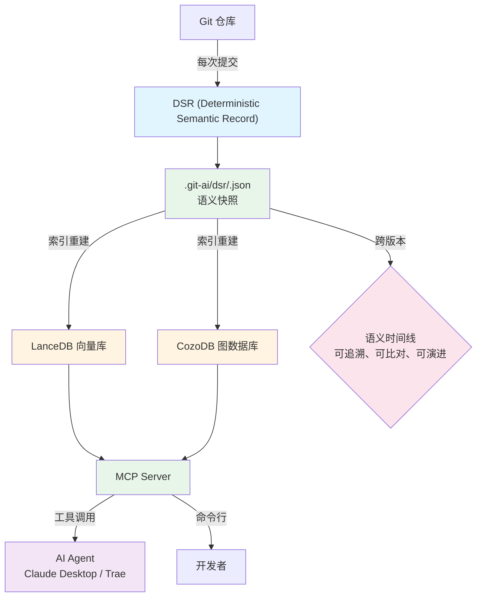

# git-ai

[](https://github.com/mars167/git-ai-cli/actions/workflows/ci.yml)
[](https://github.com/mars167/git-ai-cli/actions/workflows/release.yml)
[](./LICENSE)
[](https://github.com/mars167/git-ai-cli/packages)
[](https://www.npmjs.com/package/%40mars167%2Fgit-ai)

**简体中文** | [English](./README.md)

---

## 为代码库添加语义层，让 AI 从"读代码"进化到"懂代码"

**代码的语义，应该像代码本身一样版本化、可追溯**

git-ai 是一个本地代码理解工具，通过 DSR（确定性语义记录）和 Hyper RAG，为代码库构建可追溯的语义层，让 AI Agent 和开发者真正理解代码的演进与关系。

### ✨ 为什么选择 git-ai？

- **🔗 Hyper RAG**：融合向量检索 + 图检索 + DSR，多维度语义理解
- **📜 版本化语义**：每个提交都有语义快照，历史变更清晰可溯
- **🔄 随时可用**：索引随代码走，checkout 即可用，无需重建
- **🤖 AI 原生**：MCP Server 让 Claude、Trae 等 Agent 都能深度理解你的代码
- **🔒 完全本地**：代码永不离开你的机器，安全无忧
- **⚡ 全流程支持**：从开发到 Review 到重构，索引贯穿整个生命周期
- **📊 极速性能**：10k 文件索引 < 30 秒，搜索响应 < 100ms

---

## ✨ 核心能力

### 1️⃣ 语义搜索

用自然语言找到代码，无需记忆文件名或函数名：

```bash
git-ai ai semantic "用户认证逻辑"
git-ai ai semantic "数据库连接池配置"
git-ai ai semantic "错误处理中间件"
```

### 2️⃣ 符号关系分析

理解代码之间的调用关系：

```bash
# 查找函数调用者
git-ai ai graph callers authenticateUser

# 查找函数调用的其他函数
git-ai ai graph callees authenticateUser

# 追踪完整调用链
git-ai ai graph chain authenticateUser --max-depth 3
```

### 3️⃣ 变更历史追溯

通过 DSR 追踪符号的历史演变：

```bash
# 查看函数的历史变更
git-ai ai dsr query symbol-evolution authenticateUser --limit 50

# 查看某个提交的完整语义快照
git-ai ai dsr context
```

### 4️⃣ 跨语言支持

支持多种主流编程语言：

| 语言 | 文件后缀 |
|------|----------|
| JavaScript | `.js`, `.jsx` |
| TypeScript | `.ts`, `.tsx` |
| Java | `.java` |
| Python | `.py` |
| Go | `.go` |
| Rust | `.rs` |
| C | `.c`, `.h` |

---

## 💡 设计理念

git-ai 不只是一个搜索工具，而是代码库的"语义时间线"：

### DSR（Deterministic Semantic Record）

每个提交对应一份不可变的语义快照，记录当时的代码结构、符号关系、设计意图。代码的语义应该像代码本身一样版本化——可追溯、可比对、可演进。

### Hyper RAG

融合多种检索方式，让理解更深入：
- **向量检索**：语义相似度匹配
- **图检索**：调用关系、继承关系分析
- **DSR 检索**：历史演变追溯

### 去中心化语义

索引随代码走，不依赖中央服务器。checkout、branch、tag 都能立即使用一致的语义索引。

### Server 模式

MCP Server 让任何 AI Agent 都能调用索引，实现真正的 AI 辅助开发。

---

## 🎯 使用场景

### 场景 1：新人快速理解大型项目

> "刚加入团队，面对 10 万行代码，从哪里开始？"

```bash
# 1. 获取项目全局视图
git-ai ai repo-map --max-files 20

# 2. 搜索核心业务逻辑
git-ai ai semantic "订单处理流程"

# 3. 追踪关键函数调用链
git-ai ai graph chain processOrder --max-depth 5
```
*从设计到开发，语义索引始终如一*

### 场景 2：重构前的代码影响分析

> "要重构这个函数，会影响哪些地方？"

```bash
# 查找所有调用者
git-ai ai graph callers deprecatedFunction

# 追踪历史变更，了解设计意图
git-ai ai dsr query symbol-evolution deprecatedFunction --all
```
*DSR 追溯历史变更，理解设计意图*

### 场景 3：Bug 定位和根因分析

> "用户报告了一个错误，但不知道问题出在哪里"

```bash
# 搜索相关错误处理代码
git-ai ai semantic "用户登录失败处理"

# 查看错误传播路径
git-ai ai graph chain handleLoginError --direction upstream
```
*全流程索引，快速定位问题根源*

### 场景 4：AI Agent 辅助开发

> "让 Claude Desktop 帮我理解这个项目"

在 Claude Desktop 中配置 git-ai MCP Server 后，你可以直接对话：

> "帮我分析这个项目的架构，找出所有与支付相关的代码，并解释它们之间的关系"

Claude 会自动调用 git-ai 的工具，为你提供深入的分析。*让 AI 从"读代码"进化到"懂代码"*

---

## 🏗️ 系统架构



**核心组件**：

- **DSR (Deterministic Semantic Record)**：按提交存储的不可变语义快照，版本化语义
- **LanceDB + SQ8**：高性能向量数据库，支持语义搜索
- **CozoDB**：图数据库，支持 AST 级关系查询
- **MCP Server**：标准协议接口，供 AI Agent 调用

---

## 📊 与其他工具对比

| 特性 | git-ai | GitHub Code Search | Sourcegraph |
|------|--------|-------------------|-------------|
| 本地运行 | ✅ | ❌ | ❌ |
| AST 级分析 | ✅ | ❌ | ✅ |
| 版本化语义 | ✅ | ❌ | ❌ |
| 变更历史追溯 | ✅ | ❌ | ❌ |
| AI Agent 集成 | ✅ | ❌ | ❌ |
| 免费开源 | ✅ | ❌ | ❌ |
| 语义搜索 | ✅ | ✅ | ✅ |
| 调用链分析 | ✅ | ❌ | ✅ |

---

## 🚀 快速开始

### 1. 安装

```bash
npm install -g git-ai
```

### 2. 初始化仓库

```bash
cd your-project
git-ai ai index --overwrite
```

### 3. 立即体验

```bash
# 用自然语言搜索代码
git-ai ai semantic "用户认证逻辑"

# 查看函数调用关系
git-ai ai graph callers authenticateUser
```

**实际输出示例**：
```json
[
  {
    "file": "src/auth/service.ts",
    "line": 45,
    "symbol": "authenticateUser",
    "context": "async function authenticateUser(email: string, password: string)"
  },
  {
    "file": "src/controllers/auth.ts", 
    "line": 23,
    "symbol": "loginHandler",
    "context": "const user = await authenticateUser(req.body.email, req.body.password)"
  }
]
```

就这么简单！3 步上手，立即开始深度理解你的代码库。

*从此，索引不再是"一次性产物"，而是随代码演进的"语义资产"。*

---

## 🤖 AI Agent 集成

git-ai 提供标准的 MCP Server，可与以下 AI Agent 无缝集成：

- **Claude Desktop**：最流行的本地 AI 编程助手
- **Trae**：强大的 AI 驱动 IDE
- **Continue.dev**：VS Code AI 插件

### Claude Desktop 配置示例

在 `~/.claude/claude_desktop_config.json` 中添加：

```json
{
  "mcpServers": {
    "git-ai": {
      "command": "git-ai",
      "args": ["ai", "serve"]
    }
  }
}
```

然后重启 Claude Desktop，即可开始对话：

> "帮我分析这个项目的架构，找出所有与支付相关的代码"

Claude 会自动调用 git-ai 的工具，为你提供深入的分析。

### Agent Skills & Rules

我们提供了精心设计的 Agent 模版，帮助 AI 更好地使用 git-ai：

- [Skill 模版](./templates/agents/common/skills/git-ai-mcp/SKILL.md)：指导 Agent 如何使用工具
- [Rule 模版](./templates/agents/common/rules/git-ai-mcp/RULE.md)：约束 Agent 的行为

一键安装到你的项目：

```bash
git-ai ai agent install
```

---

## 📚 文档

- [快速入门](./docs/zh-CN/README.md)
- [MCP Server 使用指南](./docs/zh-CN/mcp.md)
- [技术架构详解](./docs/zh-CN/architecture_explained.md)
- [设计文档](./docs/zh-CN/design.md)
- [开发指南](./DEVELOPMENT.zh-CN.md)

---

## 🔧 高级功能

### Git Hooks 自动化

自动在提交前重建索引，push 前打包校验：

```bash
git-ai ai hooks install
```

- `pre-commit`：自动增量索引 + 打包
- `pre-push`：校验索引归档
- `post-checkout`：自动解包索引

### Git LFS 集成

推荐使用 Git LFS 管理索引归档：

```bash
git lfs track ".git-ai/lancedb.tar.gz"
git-ai ai pack --lfs
```

---

## 🤝 贡献

欢迎贡献代码、报告问题或提出建议！

- [贡献指南](./CONTRIBUTING.md)
- [问题追踪](https://github.com/mars167/git-ai-cli/issues)

---

## 📄 License

[MIT](./LICENSE)

---

**让 AI 从"读代码"进化到"懂代码"** ⭐ Star us on GitHub!
