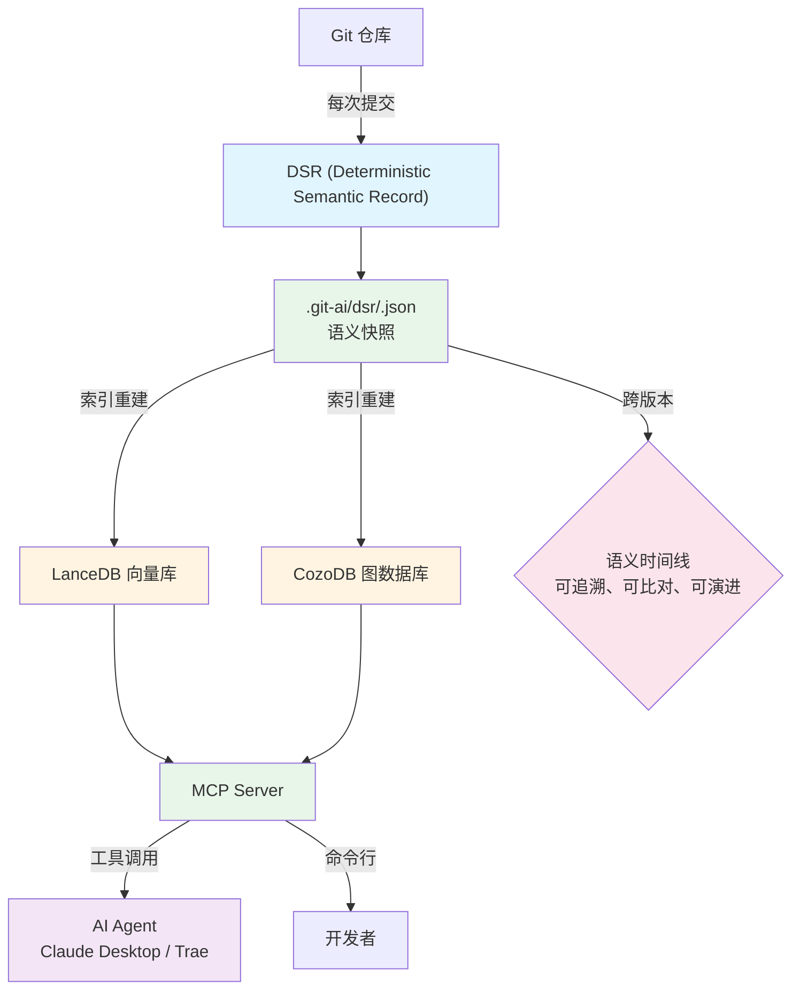

# Code Context Engine

[](https://github.com/mars167/git-ai-cli/actions/workflows/ci.yml)
[](https://github.com/mars167/git-ai-cli/actions/workflows/release.yml)
[](./LICENSE)
[](https://www.npmjs.com/package/@mars167/git-ai)
[](https://www.npmjs.com/package/@mars167/git-ai)
[](https://skills.sh)

**简体中文** | [English](./README.md)

---

<div align="center">

### 快速开始

**Agent Bundle 安装**

```bash
npx skills add mars167/git-ai-cli/skills/git-ai-code-search
```

**本地 Runtime / 兼容 CLI**

```bash
npm install -g @mars167/git-ai
```

</div>

---

## 面向 Agent 的本地代码检索与上下文引擎

**Code Context Engine 让本地仓库可以直接产出 review agent 和 coding agent 可消费的结构化上下文。**

Code Context Engine 是 `git-ai` 的新产品方向：一个面向 review、实现、影响面分析和代码探索任务的本地代码检索与上下文构建引擎。产品中心不再是 CLI 命令或 MCP primitive，而是本地 TypeScript runtime 与 agent bundle，它们会把 lexical 检索、symbol navigation、graph expand、semantic rerank 和 repo-level hints 组织成可直接消费的证据包。

### 为什么选择 Code Context Engine？

- **Lexical First**：默认以 exact token、substring、regex、literal string、path filter、language filter 做高精度召回
- **面向 Agent 的上下文**：直接返回 evidence bundle / context bundle，而不是零散搜索结果
- **深度导航**：结合 symbol search、graph expansion、repo-map hints 与 semantic rerank
- **完全本地**：代码和索引始终留在本机
- **增量友好**：复用现有本地索引与图存储能力
- **薄适配层**：CLI 和 MCP 只是可选适配，不再是产品核心

---

## 核心能力

### 1. Code Context Runtime

面向 agent 构建任务上下文：

```ts
const engine = createCodeContextEngine({ repoRoot });

const result = await engine.search.lexical({
  query: 'authenticateUser',
  mode: 'exact',
  pathPattern: 'src/auth/**',
});
```

### 2. Lexical 与结构化检索

用 exact token、substring、regex、literal string、path filter 与图扩展找到相关代码：

```bash
git-ai ai semantic "用户认证逻辑"
git-ai ai semantic "数据库连接池配置"
git-ai ai semantic "错误处理中间件"
```

### 3. 符号导航

理解代码之间的调用关系：

```bash
# 查找函数调用者
git-ai ai graph callers authenticateUser

# 查找函数调用的其他函数
git-ai ai graph callees authenticateUser

# 追踪完整调用链
git-ai ai graph chain authenticateUser --max-depth 3
```

### 4. 跨语言支持

支持多种主流编程语言：

| 语言 | 文件后缀 |
|------|----------|
| JavaScript | `.js`, `.jsx` |
| TypeScript | `.ts`, `.tsx` |
| Java | `.java` |
| Python | `.py` |
| Go | `.go` |
| Rust | `.rs` |
| C | `.c`, `.h` |
| Markdown | `.md`, `.mdx` |
| YAML | `.yml`, `.yaml` |

---

## 设计理念

Code Context Engine 采用任务优先的检索管线：

- **lexical / symbol first**：为 review 和实现类任务提供最高精度召回
- **graph expand second**：通过 callers、callees、containment、related files 扩展上下文
- **semantic rerank last**：向量检索负责补充召回与排序，不再是默认入口
- **runtime first**：本地 runtime 是产品核心；CLI 和 MCP 只是可选薄适配层

---

## 🎯 使用场景

### 场景 1：新人快速理解大型项目

> "刚加入团队，面对 10 万行代码，从哪里开始？"

```bash
# 1. 获取项目全局视图
git-ai ai repo-map --max-files 20

# 2. 搜索核心业务逻辑
git-ai ai semantic "订单处理流程"

# 3. 追踪关键函数调用链
git-ai ai graph chain processOrder --max-depth 5
```
*从设计到开发，语义索引始终如一*

### 场景 2：重构前的代码影响分析

> "要重构这个函数，会影响哪些地方？"

```bash
# 查找所有调用者
git-ai ai graph callers deprecatedFunction

# 追踪历史变更，了解设计意图
git-ai ai dsr query symbol-evolution deprecatedFunction --all
```
*DSR 追溯历史变更，理解设计意图*

### 场景 3：Bug 定位和根因分析

> "用户报告了一个错误，但不知道问题出在哪里"

```bash
# 搜索相关错误处理代码
git-ai ai semantic "用户登录失败处理"

# 查看错误传播路径
git-ai ai graph chain handleLoginError --direction upstream
```
*全流程索引，快速定位问题根源*

### 场景 4：AI Agent 辅助开发

> "让 Claude Desktop 帮我理解这个项目"

在 Claude Desktop 中配置 git-ai MCP Server 后，你可以直接对话：

> "帮我分析这个项目的架构，找出所有与支付相关的代码，并解释它们之间的关系"

Claude 会自动调用 git-ai 的工具，为你提供深入的分析。*让 AI 从"读代码"进化到"懂代码"*

---

## 🏗️ 系统架构


```mermaid
graph TB
    A[Git 仓库] -->|每次提交| B["DSR (Deterministic Semantic Record)"]
    B --> C[.git-ai/dsr/<commit>.json<br/>语义快照]
    C -->|索引重建| D[LanceDB 向量库]
    C -->|索引重建| E[CozoDB 图数据库]
    D --> F[MCP Server]
    E --> F
    F -->|工具调用| G["AI Agent<br/>Claude Desktop / Trae"]
    F -->|命令行| H[开发者]
    C -->|跨版本| I{"语义时间线<br/>可追溯、可比对、可演进"}
    
    style B fill:#e1f5ff
    style C fill:#e8f5e9
    style D fill:#fff4e1
    style E fill:#fff4e1
    style F fill:#e8f5e9
    style G fill:#f3e5f5
    style I fill:#fce4ec
```

**核心组件**：

- **DSR (Deterministic Semantic Record)**：按提交存储的不可变语义快照，版本化语义
- **LanceDB + SQ8**：高性能向量数据库，支持语义搜索
- **CozoDB**：图数据库，支持 AST 级关系查询
- **MCP Server**：标准协议接口，供 AI Agent 调用

---

## 📊 与其他工具对比

| 特性 | git-ai | GitHub Code Search | Sourcegraph |
|------|--------|-------------------|-------------|
| 本地运行 | ✅ | ❌ | ❌ |
| AST 级分析 | ✅ | ❌ | ✅ |
| 版本化语义 | ✅ | ❌ | ❌ |
| 变更历史追溯 | ✅ | ❌ | ❌ |
| AI Agent 集成 | ✅ | ❌ | ❌ |
| 免费开源 | ✅ | ❌ | ❌ |
| 语义搜索 | ✅ | ✅ | ✅ |
| 调用链分析 | ✅ | ❌ | ✅ |

---

## 🚀 快速开始

### 1. 安装

```bash
npm install -g @mars167/git-ai
```

### 2. 初始化仓库

```bash
cd your-project
git-ai ai index --overwrite
```

### 3. 立即体验

```bash
# 用自然语言搜索代码
git-ai ai semantic "用户认证逻辑"

# 查看函数调用关系
git-ai ai graph callers authenticateUser
```

**实际输出示例**：
```json
[
  {
    "file": "src/auth/service.ts",
    "line": 45,
    "symbol": "authenticateUser",
    "context": "async function authenticateUser(email: string, password: string)"
  },
  {
    "file": "src/controllers/auth.ts", 
    "line": 23,
    "symbol": "loginHandler",
    "context": "const user = await authenticateUser(req.body.email, req.body.password)"
  }
]
```

就这么简单！3 步上手，立即开始深度理解你的代码库。

*从此，索引不再是"一次性产物"，而是随代码演进的"语义资产"。*

---

## ⚙️ 配置

### 文件过滤

git-ai 遵循项目的忽略文件配置来控制哪些文件会被索引：

#### `.gitignore` - 标准 Git 忽略规则

默认情况下，匹配 `.gitignore` 中模式的文件会被排除在索引之外。

#### `.aiignore` - AI 专属排除规则（最高优先级）

在仓库根目录创建 `.aiignore` 文件，用于排除特定文件的索引，这些文件应该被 git-ai 忽略但不一定要被 Git 忽略：

```bash
# .aiignore 示例
test-fixtures/**
*.generated.ts
docs/api-reference/**
```

#### `.git-ai/include.txt` - 强制包含（覆盖 `.gitignore`）

有时您需要索引生成的代码或在 `.gitignore` 中但对代码理解很重要的文件。创建 `.git-ai/include.txt` 来强制索引特定模式：

```bash
# .git-ai/include.txt 示例
# 包含生成的 API 客户端
generated/api/**

# 包含特定的构建产物，其中包含重要的类型定义
dist/types/**

# 包含特定被忽略目录中的代码
vendor/important-lib/**
```

**优先级顺序（从高到低）：**
1. `.aiignore` - 显式排除规则始终生效
2. `.git-ai/include.txt` - 强制包含模式覆盖 `.gitignore`
3. `.gitignore` - 标准 Git 忽略模式

**支持的模式语法：**
- `**` - 匹配任意数量的目录
- `*` - 匹配目录内的任意字符
- `directory/` - 匹配整个目录（自动转换为 `directory/**`）
- `file.ts` - 匹配特定文件
- 以 `#` 开头的行为注释

**配置示例：**

```bash
# .gitignore
dist/
generated/
*.log

# .git-ai/include.txt
generated/api/**
generated/types/**

# .aiignore (覆盖所有规则)
generated/test-data/**
```

此配置下：
- ✅ `generated/api/client.ts` - 被索引（通过 include.txt 包含）
- ✅ `generated/types/models.ts` - 被索引（通过 include.txt 包含）
- ❌ `generated/test-data/mock.ts` - 不被索引（.aiignore 优先级最高）
- ❌ `dist/bundle.js` - 不被索引（在 .gitignore 中，不在 include.txt 中）

---

## 🛠️ 故障排除

### Windows 安装问题

git-ai 使用 [CozoDB](https://github.com/cozodb/cozo) 来实现 AST 图查询功能。在 Windows 上，如果遇到 `cozo-node` 相关的安装错误，可以尝试以下解决方案：

**方案一：使用 Gitee 镜像（推荐国内用户使用）**

```bash
npm install -g @mars167/git-ai --cozo_node_prebuilt_binary_host_mirror=https://gitee.com/cozodb/cozo-lib-nodejs/releases/download/
```

**方案二：配置 npm 代理**

如果你在公司防火墙或代理后面：

```bash
npm config set proxy http://your-proxy:port
npm config set https-proxy http://your-proxy:port
npm install -g @mars167/git-ai
```

**方案三：手动下载二进制文件**

1. 从 [cozo-lib-nodejs releases](https://github.com/cozodb/cozo-lib-nodejs/releases) 下载 Windows 二进制文件
2. 找到 `6-win32-x64.tar.gz`（64 位 Windows）
3. 解压到 `node_modules/cozo-node/native/6/` 目录

**验证安装：**

```bash
git-ai ai status --path .
```

如果看到 graph 相关功能正常工作，说明安装成功。

### 其他原生依赖

git-ai 还使用了以下原生包，可能需要类似的故障排除：
- `onnxruntime-node` - 用于语义向量生成
- `tree-sitter` - 用于代码解析
- `@lancedb/lancedb` - 用于向量数据库

大多数问题可以通过确保稳定的网络连接或使用镜像来解决。

---

## 🤖 AI Agent 集成

git-ai 提供标准的 MCP Server，可与以下 AI Agent 无缝集成：

- **Claude Desktop**：最流行的本地 AI 编程助手
- **Cursor**：AI 驱动的代码编辑器
- **Trae**：强大的 AI 驱动 IDE
- **Continue.dev**：VS Code AI 插件

### 单客户端模式（stdio，默认）

在 `~/.claude/claude_desktop_config.json` 中添加：

```json
{
  "mcpServers": {
    "git-ai": {
      "command": "git-ai",
      "args": ["ai", "serve"]
    }
  }
}
```

### 多客户端模式（HTTP）

当你需要多个 AI Agent 同时连接时（如同时使用 Claude Code 和 Cursor）：

```bash
# 启动 HTTP 服务（支持多客户端）
git-ai ai serve --http --port 3000
```

然后配置每个 Agent 连接到 `http://localhost:3000/mcp`。

**HTTP 模式特性：**
- 支持多个并发会话
- 健康检查端点：`http://localhost:3000/health`
- 自动管理会话生命周期
- 通过 `mcp-session-id` 响应头实现 Session 持久化
- 完善的错误处理机制，返回正确的 HTTP 状态码
- 支持 SIGTERM/SIGINT 信号，实现优雅关闭
- 可选无状态模式，用于负载均衡场景：`--stateless`

然后重启 Claude Desktop，即可开始对话：

> "帮我分析这个项目的架构，找出所有与支付相关的代码"

Claude 会自动调用 git-ai 的工具，为你提供深入的分析。

### Agent Skills & Rules

我们提供了精心设计的 Agent 模版，帮助 AI 更好地使用 git-ai：

- [Skill 模版](./templates/agents/common/skills/git-ai-code-search/SKILL.md)：指导 Agent 如何使用工具
- [Rule 模版](./templates/agents/common/rules/git-ai-code-search/RULE.md)：约束 Agent 的行为

Skills/Rules 文档（Markdown/YAML）会被纳入语义索引，便于通过 `semantic_search` 检索 MCP 指南。

一键安装到你的项目：

```bash
git-ai ai agent install
```

---

## 📚 文档

- [快速入门](./docs/zh-CN/README.md)
- [MCP Server 使用指南](./docs/zh-CN/mcp.md)
- [技术架构详解](./docs/zh-CN/architecture_explained.md)
- [设计文档](./docs/zh-CN/design.md)
- [开发指南](./DEVELOPMENT.zh-CN.md)

---

## 🔧 高级功能

### Git Hooks 自动化

自动在提交前重建索引，push 前打包校验：

```bash
git-ai ai hooks install
```

- `pre-commit`：自动增量索引 + 打包
- `pre-push`：校验索引归档
- `post-checkout`：自动解包索引

### Git LFS 集成

推荐使用 Git LFS 管理索引归档：

```bash
git lfs track ".git-ai/lancedb.tar.gz"
git-ai ai pack --lfs
```

---

## 🤝 贡献

欢迎贡献代码、报告问题或提出建议！

- [贡献指南](./CONTRIBUTING.md)
- [问题追踪](https://github.com/mars167/git-ai-cli/issues)

---

## 📄 License

[MIT](./LICENSE)

---

**让 AI 从"读代码"进化到"懂代码"** ⭐ Star us on GitHub!
