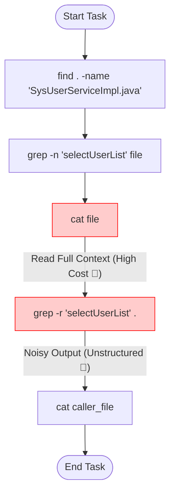
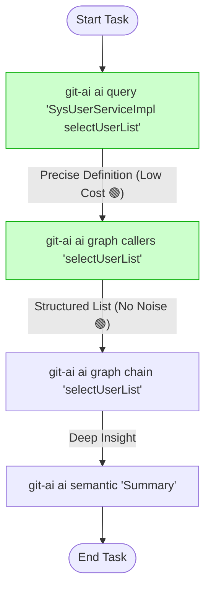

# Git-AI 效能基准测试工具 (Benchmark Tool)

本工具旨在量化评估 **Git-AI 工具集** 与 **传统 Linux/Git 检索工具** 在 AI Agent 代码辅助任务中的效能差异。通过模拟真实的复杂代码分析场景，对比两者的 Token 消耗、检索路径长度及上下文有效性，为 Agent 工具选型提供精确的数据支持。

## 1. 测试背景与目标

在 AI 辅助编程（Copilot/Agent）场景中，**上下文窗口（Context Window）** 和 **Token 成本** 是核心约束。
传统的代码检索方式（grep/cat/find）往往返回大量非结构化的冗余文本，迫使 Agent 消耗大量 Token 去阅读和过滤无效信息。

**Git-AI** 通过建立本地代码索引（符号表、AST 调用图、语义向量），旨在提供“高密度、结构化”的检索结果。本基准测试的目标是验证并量化这一优势。

## 2. 测试场景设计 (Scenario)

我们选择了一个典型的企业级 Java 项目 **RuoYi (SpringBoot)** 作为测试靶场，模拟一个中等复杂度的代码分析任务。

*   **测试任务**：全链路分析 `SysUserServiceImpl.java` 中 `selectUserList` 方法的实现逻辑及其在系统中的调用关系。
*   **任务复杂度**：
    *   **跨文件检索**：定义与引用位于不同包/模块。
    *   **上下文依赖**：需要阅读方法体代码以理解逻辑。
    *   **引用分析**：需要找出谁调用了该方法（Call Hierarchy）。
    *   **语义理解**：需要生成该方法的功能摘要。

## 3. 对照组设定 (Methodology)

测试分为两组，由自动化脚本模拟 AI Agent 的标准行为模式：

### Group A：基准组 (Baseline - Linux/Git Tools)
模拟一个未集成专业代码工具的通用 Agent，依赖基础 Shell 命令进行探索。



*   **工作流 (Workflow)**：
    1.  **定位文件** (`find`)：通过文件名模糊查找目标文件。
    2.  **定位定义** (`grep -n`)：在文件中搜索方法名以获取行号。
    3.  **读取内容** (`cat`)：**关键痛点**。由于 Agent 无法预知方法结束行，且为了获取完整上下文（Imports、类成员变量等），通常倾向于读取整个文件或大段文本。本测试模拟读取全文件。
    4.  **查找引用** (`grep -r`)：全局搜索方法名。**关键痛点**。返回结果包含大量噪点（注释、同名方法、字符串），且缺乏语法结构信息。
    5.  **读取调用方** (`cat`)：为了确认调用上下文，再次读取调用方文件的完整内容。

### Group B：实验组 (Experimental - Git-AI)
模拟集成了 Git-AI MCP/CLI 工具的专业 Coding Agent。



*   **工作流 (Workflow)**：
    1.  **精确符号跳转** (`git-ai ai query`)：直接通过符号名（Symbol）获取定义位置及代码片段，无需读取全文件。
    2.  **结构化引用图** (`git-ai ai graph callers`)：基于 AST（抽象语法树）的精确引用查找，直接返回调用方列表，无文本噪点。
    3.  **调用链分析** (`git-ai ai graph chain`)：自动计算上下游调用链路，一步到位获取深度信息。
    4.  **语义摘要** (`git-ai ai semantic`)：基于向量检索（RAG）获取方法的逻辑摘要，Top-K 精确召回。

## 4. 评估指标 (Metrics)

| 指标 | 英文名称 | 含义与业务价值 |
| :--- | :--- | :--- |
| **搜索 Token 总量** | Total Search Tokens | **成本核心**。完成任务过程中所有工具输出内容的 Token 总和。越低越好，意味着更低的 API 成本和更快的首字延迟。 |
| **检索步数** | Steps to Solution | **延迟核心**。Agent 与环境交互的轮次。越少越好，意味着更快的响应速度和更少的推理开销。 |
| **上下文密度** | Context Density | **质量核心**。`有效信息 / 总Token`。Git-AI 通过结构化数据（JSON/YAML）替代原始文本，显著提升了密度。 |
| **总耗时** | Total Time | 任务执行的端到端时间（不含 LLM 生成时间，仅计算工具执行耗时）。 |

## 5. 实测数据 (RuoYi 项目)

在 RuoYi 项目（v4.x）上的实测结果如下：

| Metric | Baseline (grep/cat) | Experimental (git-ai) | Improvement |
| :--- | :--- | :--- | :--- |
| **Total Search Tokens** | **7,093** | **2,347** | **📉 -66.9%** |
| **Steps to Solution** | **5** | **4** | **📉 -20.0%** |
| **Avg Tokens/Step** | **1418.6** | **586.8** | **📉 -58.6%** |
| **Total Time** | **5.42s** | **2.69s** | **⚡️ 2x Faster** |

> **结论**：Git-AI 方案在 Token 消耗上减少了 **约 67%**，这意味着在同样的 Context Window 下，Agent 可以处理 **3 倍** 规模的代码上下文，或者节省 **2/3** 的推理成本。

## 6. 快速开始

### 环境要求
*   Python 3.9+
*   已安装 `git-ai` CLI 工具并配置好环境路径
*   Python 依赖：`tiktoken`, `tabulate`

### 安装
```bash
cd benchmark_tool
pip install -r requirements.txt
```

### 运行测试
指定一个本地 Git 仓库路径（建议先在目标仓库执行 `git-ai ai index` 生成索引以获得最佳性能）：

```bash
# 格式：python3 benchmark.py <目标仓库绝对路径>
python3 benchmark.py /Users/mars/dev/ruoyi
```

## 7. 技术实现细节

*   **Token 计算**：使用 OpenAI `tiktoken` (cl100k_base 编码器) 进行精确计数，与 GPT-4 计费标准一致。
*   **执行环境**：使用 `subprocess` 独立进程执行命令，确保环境隔离。
*   **容错处理**：模拟脚本包含基础的错误处理逻辑，如文件未找到时的降级策略，确保测试稳定性。
