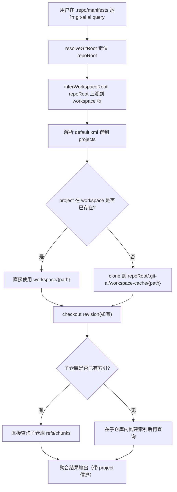

# Manifest Workspace（`.repo/manifests`）支持（Ref 指针 + 按需索引/查询）

这篇文档说明 `git-ai` 如何在 **Android repo tool** 的 workspace 场景中工作：在 `.../.repo/manifests` 这种 *manifest 仓库* 中，`git-ai` 不会把所有子仓库的索引都塞进 manifest 仓库；而是把 manifest 里的 `<project/>` 视为“ref 指针”，在查询时按需定位/检出对应子仓库，并在子仓库内查询（必要时再构建索引）。

适用目录结构示例：

```text
workspace/
  .repo/
    manifests/          # 运行 git-ai 的位置
      .git/
      default.xml
  project-a/
    .git/
    ...
  project-b/
    .git/
    ...
```

## 背景与目标

在 repo tool workspace 中：
- **真正的代码**分散在 `workspace/` 下的多个 project 子仓库（`project-a/`、`project-b/`…）
- **manifest 仓库**位于 `workspace/.repo/manifests`，负责描述 project 列表与 revision

如果把 workspace 下所有源码都索引进 manifest 仓库，会带来：
- 存储成本高：manifest 仓库的 `.git-ai/` 会膨胀（尤其在多项目 workspace）
- 性能风险：一次索引要扫描大量目录，且每次增量都集中写到同一个 DB

因此本方案改为：
- manifest 仓库只索引自身（如需要），不存储所有子仓库索引
- 子仓库索引由子仓库自己维护（`.git-ai/lancedb/` 或 `.git-ai/lancedb.tar.gz`）
- 查询时按需切到/拉取对应子仓库，再查询其索引

## 行为概览

当你在 manifest 仓库运行：

```bash
git-ai ai query SomeClass --limit 20
```

`git-ai` 会：
- 解析 manifest（默认 `default.xml`）得到 project 列表（相当于“ref 指针”集合）
- 对每个 project：
  - 优先使用 workspace 本地已有目录（`workspace/<project path>`）
  - 若本地不存在，则克隆到 `workspace-cache`（在 manifest 仓库的 `.git-ai/` 下，不提交）
  - 切到 manifest 指定的 revision（如果有）
  - 若子仓库已有索引则直接查询；否则按需构建索引后查询

### 流程图（按需查询）



## 关键实现点

### 1) 推导 workspaceRoot（workspace 根目录）

判断逻辑：
- 当 `repoRoot` 的路径中包含 `.repo/manifests` 或 `.repo/manifests.git` 时，认为这是 manifest 仓库
- 将 `workspaceRoot` 设为 `.repo` 的上一级目录（即 workspace 根）

实现入口：[inferWorkspaceRoot](file:///Users/mars/dev/git-ai/git-ai-cli-v2/src/core/git.ts)

### 2) Manifest 解析（project 列表作为 ref 指针）

当前实现会读取 manifest 仓库中的 `default.xml`（如果没有则尝试其他 `*.xml`），解析：
- `<project name path remote revision/>`
- `<remote name fetch/>` 与 `<default remote revision/>`

相关实现：
- [manifest.ts](file:///Users/mars/dev/git-ai/git-ai-cli-v2/src/core/manifest.ts)

### 3) 子仓库按需检出（workspace 优先，缺失则 cache clone）

- 若 `workspace/<project path>` 已存在且是 git 仓库：直接使用
- 否则 clone 到 `repoRoot/.git-ai/workspace-cache/<project path>`（该目录不应提交）
- 若 manifest 提供 revision：切到对应 revision（或 `origin/<revision>`）

相关实现：[workspace.ts](file:///Users/mars/dev/git-ai/git-ai-cli-v2/src/core/workspace.ts)

### 4) 子仓库索引按需使用（优先现有索引，缺失则构建）

查询时针对每个子仓库：
- 若存在 `.git-ai/lancedb/`：直接打开查询
- 否则若存在 `.git-ai/lancedb.tar.gz`：先解包再查询
- 都不存在时：在该子仓库内按需构建索引，再查询

相关实现：
- [ensureRepoIndexReady](file:///Users/mars/dev/git-ai/git-ai-cli-v2/src/core/workspace.ts)
- CLI 查询入口：[ai query](file:///Users/mars/dev/git-ai/git-ai-cli-v2/src/commands/query.ts)
- MCP 符号检索在 manifests 场景下也会走按需查询：[server.ts](file:///Users/mars/dev/git-ai/git-ai-cli-v2/src/mcp/server.ts)

### 5) 存储成本与性能策略

- manifest 仓库只保存“ref 指针”（manifest XML）与少量运行时缓存（workspace-cache），避免把所有子仓库索引集中存储
- 查询只触达必要的子仓库，并在拿到足够结果后提前停止
- workspace-cache 放在 `.git-ai/` 下并通过 `.gitignore` 排除，避免污染 manifest 仓库历史

## 使用方式

### 直接在 manifests 仓库查询

```bash
cd /ABS/PATH/workspace/.repo/manifests
git-ai ai query SomeClass --limit 20
```

输出里会包含 `rows[].project` 字段，标明结果来自哪个子仓库（以及是从 workspace 还是 cache 来的）。

### 验证模版

仓库内提供了一个最小模版可以一键生成 workspace 并验证：
- 文档：[repo-manifest-workspace-template/README.md](file:///Users/mars/dev/git-ai/git-ai-cli-v2/examples/repo-manifest-workspace-template/README.md)
- 初始化脚本：[init-workspace.mjs](file:///Users/mars/dev/git-ai/git-ai-cli-v2/examples/repo-manifest-workspace-template/init-workspace.mjs)

## 已知限制与后续方向

- 当前 XML 解析为轻量实现，覆盖常见的 `<remote/>`、`<default/>`、`<project/>` 场景；更复杂的 include/override 还未覆盖。
- 若 manifest 未提供 remote fetch 且 workspace 本地也不存在对应 project 目录，则无法自动 clone。
