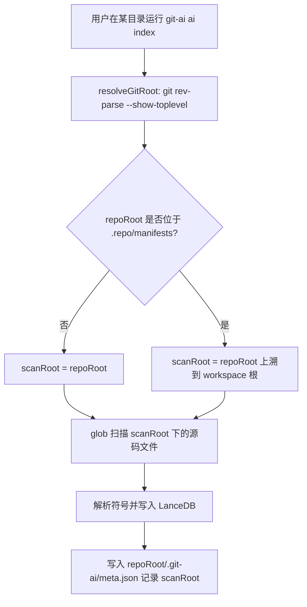

# Manifest Workspace（`.repo/manifests`）索引支持

这篇文档说明 `git-ai` 如何在 **Android repo tool** 的 workspace 场景中工作：当你在 `.../.repo/manifests` 这种 *manifest 仓库* 中执行索引命令时，`git-ai` 会把 **workspace 根目录**作为扫描范围，把同一 workspace 下的多个 project 子仓库源码一并索引到 manifest 仓库的 `.git-ai` 数据库里。

适用目录结构示例：

```text
workspace/
  .repo/
    manifests/          # 运行 git-ai 的位置
      .git/
      default.xml
  project-a/
    .git/
    ...
  project-b/
    .git/
    ...
```

## 背景与目标

在 repo tool workspace 中：
- **真正的代码**分散在 `workspace/` 下的多个 project 子仓库（`project-a/`、`project-b/`…）
- **manifest 仓库**位于 `workspace/.repo/manifests`，负责描述 project 列表与 revision

如果只按“当前 git 仓库根目录”来索引（`workspace/.repo/manifests`），会遗漏 workspace 下的项目源码；因此需要把扫描根目录提升到 `workspace/`。

## 行为概览

当你在 manifest 仓库运行：

```bash
git-ai ai index --overwrite
```

`git-ai` 会：
- `repoRoot`：仍然使用 `workspace/.repo/manifests`（索引产物写入这里的 `.git-ai/`）
- `scanRoot`：自动提升到 `workspace/`（扫描 workspace 下所有源代码文件，排除 `.repo/` 等目录）

### 流程图（CLI 索引）



## 关键实现点

### 1) 推导 scanRoot（workspace 根目录）

判断逻辑：
- 当 `repoRoot` 的路径中包含 `.repo/manifests` 或 `.repo/manifests.git` 时，认为这是 manifest 仓库
- 将 `scanRoot` 设为 `.repo` 的上一级目录（即 workspace 根）

实现入口：[inferScanRoot](file:///Users/mars/dev/git-ai/git-ai-cli-v2/src/core/git.ts)

### 2) Indexer 支持以 scanRoot 扫描，以 repoRoot 存储

- `IndexerV2` 新增 `scanRoot` 参数
- glob 扫描从 `cwd: scanRoot` 进行
- `.git-ai` 数据库仍保存在 `repoRoot/.git-ai/`（便于 manifest 仓库统一提交/归档索引）
- `meta.json` 增加 `scanRoot` 字段（相对 repoRoot 的路径），用于后续工具读取

相关实现：
- [IndexerV2](file:///Users/mars/dev/git-ai/git-ai-cli-v2/src/core/indexer.ts)
- [ai index 命令](file:///Users/mars/dev/git-ai/git-ai-cli-v2/src/commands/index.ts)

### 3) MCP `read_file/list_files` 按 scanRoot 读取

在 workspace 模式下，索引记录的 `file` 是以 `scanRoot` 为基准的相对路径（例如 `project-b/src/main/java/...`）。  
因此 MCP 的文件读取能力也需要以 `scanRoot` 为根，才能正确读取文件内容（同时保持路径越界保护）。

相关实现：[GitAIV2MCPServer](file:///Users/mars/dev/git-ai/git-ai-cli-v2/src/mcp/server.ts)

### 4) 必要的 ignore（避免噪声与安全边界）

workspace 扫描时默认忽略：
- `.repo/**`（避免把 repo 管理目录也索引进去）
- `**/.git/**`、`**/.git-ai/**`（避免索引 git 元数据与索引产物）
- `**/target/**`、`**/build/**`、`**/.gradle/**`（避免构建目录噪声）

## 使用方式

### 直接在 manifests 仓库索引

```bash
cd /ABS/PATH/workspace/.repo/manifests
git-ai ai index --overwrite
git-ai ai query SomeClass --limit 20
```

输出里会包含：
- `repoRoot`：`.../.repo/manifests`
- `scanRoot`：`.../workspace`

### 验证模版

仓库内提供了一个最小模版可以一键生成 workspace 并验证：
- 文档：[repo-manifest-workspace-template/README.md](file:///Users/mars/dev/git-ai/git-ai-cli-v2/examples/repo-manifest-workspace-template/README.md)
- 初始化脚本：[init-workspace.mjs](file:///Users/mars/dev/git-ai/git-ai-cli-v2/examples/repo-manifest-workspace-template/init-workspace.mjs)

## 已知限制与后续方向

- 当前实现只做“按路径结构推导 workspace 根目录”，不解析 `default.xml` 的 project 列表；也就是说会扫描 workspace 下匹配后缀的源码文件（并通过 ignore 排除噪声目录）。
- 若你的 workspace 根目录非常大（包含大量非项目目录），建议通过 `.aiignore` 在 manifest 仓库里进一步排除扫描范围。

